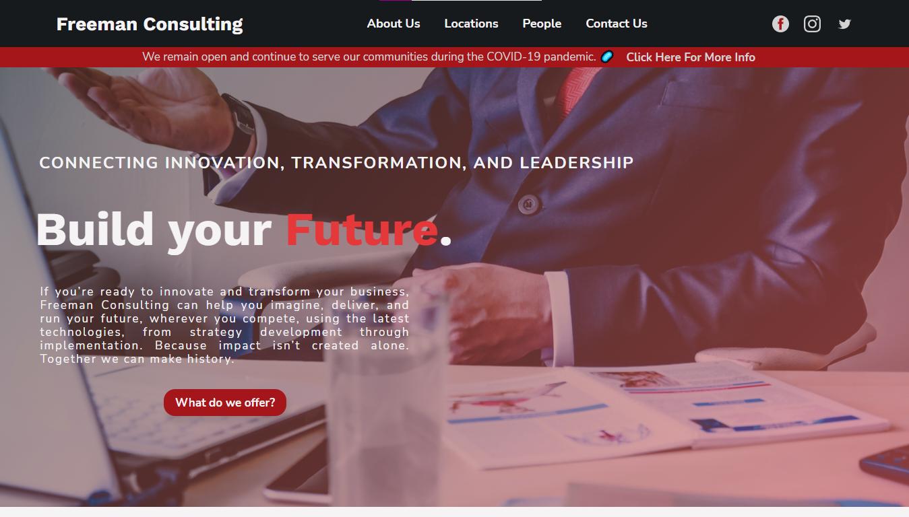

# Freeman Consulting - Unfinished

A consulting site I made for fun and to practice my design/frontend development skills.

## Table of contents

- [Screenshot](#screenshot)
- [Link](#link)
- [Built with](#built-with)
- [Project Takeaways](#project-takeaways)

### Screenshot

### Link

Solution URL: [Click Here](https://matejgroombridge.github.io/Consulting-Site)

### Built with

- HTML5
- SCSS
- Javascript
- Desktop First Workflow

### Project Takeaways

- I didn't learn heaps from this project, it was mainly for practice.
